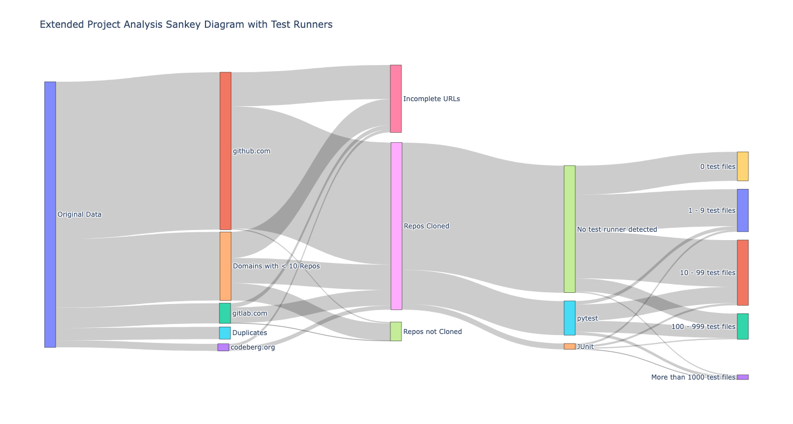

# nlnet
Analysis of the opensource codebases of NLnet sponsored projects.

[](./reports/junit/report.html)
[](./reports/junit/report.html)

This project offers several forms of analysis including:

* A sankey diagram as a visual report of the relationship between projects and any automated test files detected here.
* A database in supabase populated with the output of the `guesslang` utility. (Note: we're using a [fork](https://github.com/commercetest/guesslang) of the guesslang project as that hasn't been updated to support more recent version of python.)

## Objectives
The main objective is to be able to identify characteristics of existing and current testing practices recorded in the opensource repos of projects that have received funding from NLnet foundation. These details may then enable us to identify ways to help distill approaches that may help several of these projects in tandem (concurrently).

## Data structure
The columns are: `project code, public page, code repository`

Some projects have multiple repos, these are on their own row in the dataset.

The source file is in TSV (Tab Separated Values) format.

## Structure of this repo
In general, much of the work will be identified in this repo's https://github.com/commercetest/nlnet/issues, and various more general notes will be recorded in Wiki pages at https://github.com/commercetest/nlnet/wiki


After the `nlnet` repository has been cloned, two options are available for configuring the repository structure based on the intended use of the provided `.tsv` file:

   - Default Repository Structure: The `.tsv` file should be placed directly in the `data` folder within the project repository. This setup allows the scripts to be run without         additional configuration.
   - Custom Directory: Should a different structure be preferred, a directory can be created within the project repository to store the `.tsv `file. For example, a directory named    `nlnet_data` may be created. Once the `.tsv` file is placed in this new directory, the path must be specified when running the script. The `--input-file` flag should be used        followed by the relative path to the `.tsv file`, as shown below:
     ```
     --input-file nlnet_data/tsv_file_name.tsv
     ```

Informative docstrings detailing the functionality and the supported command-line arguments have been provided at the beginning of each script. Additionally, the `Scripts` section in the README.md offers further guidance on using these arguments.


## Runtime environment
I'm using miniforge to manage the python environment including packages.

```
conda create --name commercetest-nlnet python=3.10 pandas
conda activate commercetest-nlnet
pip install -r requirements.txt
```

For GitHub API queries this project uses a Personal Access Token (PAT).

Generated a PAT for authentication with the Github API (Expiration 90 days Scopes → public_repo)

Chose the endpoints:
- Repositories Endpoint: To get information about repositories.
- Contents Endpoint: To access the file structure of a repository.
- Search Code Endpoint: To search within repositories for specific words or phrases.

https://github.com/settings/tokens?type=beta


## Checking the quality of our code
We'd like to learn by doing, this includes experimenting with various code quality tools and techniques. Currently we're experimenting with `ruff`, pre-commit checks, and using `pytest` to generate test reports which are then post-processed to provide a coverage badge.

```
pytest --junit-xml=reports/junit/junit.xml --html=reports/junit/report.html
genbadge tests --output-file reports/junit/tests-badge.svg

pytest --cov-report xml:reports/coverage/coverage.xml --cov .
genbadge coverage --output-file reports/coverage/coverage-badge.svg
```

The pre-commit hooks are run automatically by `git`. They can also be run interactively https://pre-commit.com/#4-optional-run-against-all-the-files which can help to reduce the number of aborted commits for whitespace and other minor issues. Here's an example of how to run it:
`pre-commit run --all-files`


## Scripts

1. initial_data_preparation.py:

   #### Overview

   This script processes a TSV file to generate a DataFrame from which it extracts domains and organises entries into separate DataFrames based on these domains. Each domain is stored as a record. Each domain-specific DataFrame is saved as a CSV file if it contains more than 10 records. For domains with fewer than 10 records, the DataFrame is saved as 'other_domains.csv` .This approach ensures that data is systematically organised and readily accessible for further       analysis.

   Designed to be highly flexible, the script supports command-line arguments, allowing users to specify custom paths for the input TSV file and the output directories. This makes    the script ideal for integration into automated workflows where paths may vary.

   #### Features

   - Dynamic Data Handling: Reads a TSV file specified by the user, and extracts critical information.
   - Data Cleaning: Performs cleaning of the data by removing null values and duplicates.
   - Domain Extraction: Identifies and extracts the domain from each URL in the 'repourl' column to ascertain the hosting platform.
   - Data Organisation: Segregates the DataFrame into multiple DataFrames based on unique domains, facilitating focused analysis for each domain.
   - Conditional Saving: Saves DataFrames that contain more than 10 entries into a structured directory format, tailored specifically for repositories hosted under distinct             domains.
   - Output Reporting: Generates a count of repositories for each domain, saved into a text file for easy reference and further analysis.
   - Command Line Arguments
   - `--input-file`: Specifies the path to the input TSV file.
   - `--output-folder`: Specifies the directory where output CSV files and other results will be saved.

   #### Functions
   - parse_args(): Parses command-line arguments to customise input and output paths.
   - mark_duplicates(df): Marks duplicate rows in the DataFrame.
   - mark_null_values(df): Marks rows with null values in the DataFrame.
   - extract_and_flag_domains(df): Extracts domains from URLs and flags rows with unsupported URL schemes.
   - mark_incomplete_urls(df): Identifies incomplete URLs in the DataFrame.
   - get_base_repo_url(df): Extracts the base repository URL from various hosting platforms.

   #### Output DataFrame Columns:
   - 'projectref': Unique project reference identifier.
   - 'nlnetpage': NLnet project page URL.
   - 'repourl': Repository URL extracted from the project page.
   - 'duplicate_flag': Flag indicating duplicate rows.
   - 'null_value_flag': Flag indicating rows with null values.
   - 'repodomain': Extracted domain from the repository URL.
   - 'unsupported_url_scheme': Flag indicating unsupported URL schemes.
   - 'incomplete_url_flag': Flag indicating incomplete URLs.
   - 'base_repo_url': Base repository URL extracted from various hosting platforms.
   - 'base_repo_url_flag': Flag indicating success or failure of base repository URL extraction.

   #### Usage
   To use this script, you can specify all necessary command line arguments based on your requirements. For example:
   ```bash
   python initial_data_preparation.py -input-file path/to/input_file.tsv
   --output-folder path/to/output_directory
   ```


2. git_utils.py:

   #### Overview

   This utility module enhances Python scripts by providing robust functions for managing and interacting with Git repositories. It's designed to facilitate the identification of     the Git repository's root and to ensure that scripts operate relative to the correct directory, especially in environments where the execution context might vary.

   #### Features

   Git Repository Root Detection: Determines the root directory of the current Git repository using the git rev-parse --show-toplevel command. This is crucial for scripts that        need to operate relative to the repository root.
   Context-Aware Path Management: Offers a method to reliably determine the appropriate base directory for file operations, whether inside a Git repository or not, thus enhancing     script portability and robustness.

   #### Usage
   The functions in this script has been imported in other scripts where nteracting with Git repository is reqired.

   ```
   from utils.git_utils import get_working_directory_or_git_root
   work_dir = get_working_directory_or_git_root()
   print(f"Working directory or Git root: {work_dir}")
   ```


3. github_repo_request_local.py:

   #### Overview

   This script automates the process of cloning GitHub repositories listed in a CSV file, counts the number of test files in each repository, and saves both the count and the last    commit hash back to the CSV. Additionally, it writes the repository URL followed by the names of all test files found within that repository to a specified text file,              facilitating detailed record-keeping and auditing of test file existence across repositories. The script is designed to handle interruptions and errors more robustly by            independently verifying the completion of each critical operation including cloning, commit hash retrieval, test file counting, and the writing of test file records. It saves      progress incrementally and can resume where it left off, ensuring that data from previous runs is properly managed.

   #### Enhancements

   This script includes several enhancements to improve its functionality:

   - **GitHub URL Parsing:** Ensures only repository roots are targeted by parsing and correcting GitHub URLs.
   - **File Extension Exclusion:** Allows exclusion of specific file extensions during the test file count to tailor the data collection.
   - **Retention of Clones:** Optional retention of cloned repositories post-processing, which can be useful for subsequent manual reviews or further automated tasks.
   - **Batch Processing:** Manages large sets of data efficiently and saves progress periodically.
   - **Turtle Format Conversion:** Converts the final data collection to Turtle (TTL) format for RDF compliant data storage, with the ability to specify the output location.
   - **Auditing and Verification:** Writes repository URLs and associated test file names to a text file for easy auditing and verification. The location of this text file can be       specified via command-line arguments.

   #### Configuration

   Users can customize their experience with the script through several command-line arguments:

   - `--exclude`: Specify file extensions to exclude from test file counts.
   - `--clone-dir`: Set a custom directory for cloning the repositories.
   - `--keep-clones`: Option to retain cloned repositories after processing.
   - `--input-file`: Path to the input CSV file.
   - `--output-file`: Path to the output CSV file that includes test file counts and last commit hashes.
   - `--test-file-list`: Path to the text file for recording repository URLs and test file names.
   - `--ttl-file`: Path to save the Turtle (TTL) format file.

   #### Usage

   To use this script, you can specify all necessary command line arguments based on your requirements. For example:

   ```
   python script.py --exclude ".md,.txt" --clone-dir "/path/to/clone/directory" --input-file "repos.csv" --output-file "output.csv" --keep-clones
   ```

4. github_repo_requests.py:

   #### Overview

   This script facilitates the analysis of GitHub repositories by interfacing with the GitHub API. It processes a CSV file containing
   repository URLs, counts the number of test files within each repository, fetches the latest commit information, and updates this data
   back into the CSV file.

   #### Key Features

      -  **CSV File Processing**: Load and validate data from a CSV file, checking for null values and duplicates.
      -  **GitHub Interaction**: Interface with the GitHub API to perform searches within repositories and retrieve commit information.
      -  **Rate Limiting**: Respect GitHub API rate limits with built-in delay and retry logic.
      -  **Data Enrichment**: Update the original CSV file with the count of test files and the latest commit data for each repository.


5. sankey_diagram_plotly.py:

   #### Overview

   This script visualises the usage of various test runners across cloned
   repositories. It scans repositories for test patterns and dependencies, and
   visualises the data using a Sankey diagram in a web browser. Please see an
   example of the resulting diagram below.

   #### Usage

    The script is intended to be run with command line arguments specifying
    paths for input data and output.
    Command-line usage example:
   ```
   python sankey_diagram_plotly.py --clone-dir=data/cloned_repos
   --input-file=data/input.csv --output-file=data/output.csv`
   ```
   


6. supabase_db_interactions.py

   #### Overview
   This script demonstrates how to interact with a Supabase database using Python.
   It utilises the `dotenv` library to load environment variables
   from a `.env` file and the `supabase-py` library to perform database
   operations.
   The script includes functions to write data to and read data from a Supabase
   table.

   #### Features
   - Command-Line Arguments:

       `--logfile-path`: Specify the path to the logfile. If not provided, it defaults to `supabase/write_to_db.log`
   in the working directory ( if the current directory is not within a Git repository) or the git root ( the path to
   the top-level directory of the current Git repository).
   Example:
   ```
   python supabase_script.py --logfile-path "/path/to/logfile.log"
   ```
   - Environment Variables:
     - `SUPABASE_URL`: The URL of the Supabase instance.
     - `SUPABASE_KEY`: The API key for accessing the Supabase instance.

     Your `.env` file should look more-or-less like this depending on your actual values for these two environment
   variables.
   ```
     SUPABASE_URL=https://your-supabase-url.supabase.co
     SUPABASE_KEY=your-api-key
   ```


7. guesslang_to_db.py

   #### Overview
   This script provides functionality to analyse files within cloned
   repositories, detect their programming languages using
   the guesslang library, and write the results to a Supabase database.

   Run the script with the appropriate `--clone-dir` argument specifying the
   directory where repositories are cloned or let it use the default
   directory (located in the `cloned_repos` folder under the `data` directory).

   Example:

    ```
   python script.py --clone-dir /path/to/cloned_repos
   ```


## Related projects
Work on the data analysis of NLnet projects is also maintained in: https://codeberg.org/NGI0Review/harvest (and the test coverage tracked online at https://artifacts.nlnet.nl/harvest/main/coverage/). In future some or all of this repo's work may migrate there, for the moment this repo facilitates exploration and experimentation.
